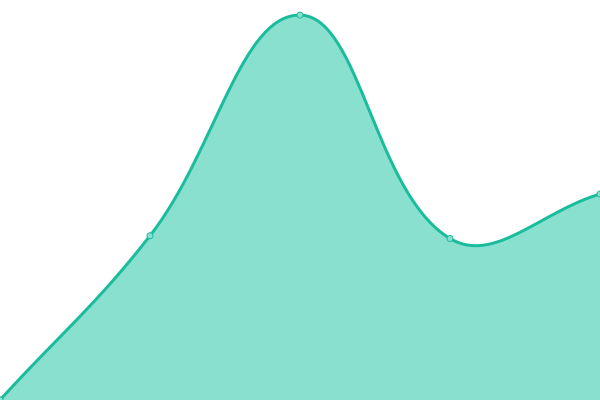

# [📈 Live Status](https://demo.upptime.js.org): <!--live status--> **🟧 Partial outage**

This repository contains the open-source uptime monitor and status page for [edgardoramosroque](https://demo.upptime.js.org), powered by [Upptime](https://github.com/upptime/upptime).

With [Upptime](https://upptime.js.org), you can get your own unlimited and free uptime monitor and status page, powered entirely by a GitHub repository. We use [Issues](https://github.com/edgardoramosroque/status/issues) as incident reports, [Actions](https://github.com/edgardoramosroque/status/actions) as uptime monitors, and [Pages](https://demo.upptime.js.org) for the status page.

<!--start: status pages-->
<!-- This summary is generated by Upptime (https://github.com/upptime/upptime) -->
<!-- Do not edit this manually, your changes will be overwritten -->
<!-- prettier-ignore -->
| URL | Status | History | Response Time | Uptime |
| --- | ------ | ------- | ------------- | ------ |
|  [Portal UNA](https://www.una.ac.cr) | 🟩 Up | [portal-una.yml](https://github.com/EdgardoRamosRoque/status/commits/HEAD/history/portal-una.yml) | 

 3540ms
     
 | 

<a href="https://edgardoramosroque.github.io/status/history/portal-una">96.43%</a>
    

|  [Aula Virtual - Institucional](https://www.aulavirtual.una.ac.cr/login/index.php) | 🟩 Up | [aula-virtual-institucional.yml](https://github.com/EdgardoRamosRoque/status/commits/HEAD/history/aula-virtual-institucional.yml) | 

 1754ms
     
 | 

<a href="https://edgardoramosroque.github.io/status/history/aula-virtual-institucional">96.46%</a>
    

|  [Portal Bibliotecas](https://www.siduna.una.ac.cr/) | 🟩 Up | [portal-bibliotecas.yml](https://github.com/EdgardoRamosRoque/status/commits/HEAD/history/portal-bibliotecas.yml) | 

 1877ms
     
 | 

<a href="https://edgardoramosroque.github.io/status/history/portal-bibliotecas">96.49%</a>
    

|  [Portal Directorio](https://www.directorio.una.ac.cr/) | 🟩 Up | [portal-directorio.yml](https://github.com/EdgardoRamosRoque/status/commits/HEAD/history/portal-directorio.yml) | 

 4573ms
     
 | 

<a href="https://edgardoramosroque.github.io/status/history/portal-directorio">95.80%</a>
    

|  [Calendario Universitario](https://www.calendario.una.ac.cr/) | 🟩 Up | [calendario-universitario.yml](https://github.com/EdgardoRamosRoque/status/commits/HEAD/history/calendario-universitario.yml) | 

 3075ms
     
 | 

<a href="https://edgardoramosroque.github.io/status/history/calendario-universitario">95.88%</a>
    

|  [Portal Preguntas Frecuentes](https://www.preguntasfrecuentes.una.ac.cr/) | 🟩 Up | [portal-preguntas-frecuentes.yml](https://github.com/EdgardoRamosRoque/status/commits/HEAD/history/portal-preguntas-frecuentes.yml) | 

 2860ms
     
 | 

<a href="https://edgardoramosroque.github.io/status/history/portal-preguntas-frecuentes">95.93%</a>
    

|  [Portal Documentos](https://www.documentos.una.ac.cr/) | 🟩 Up | [portal-documentos.yml](https://github.com/EdgardoRamosRoque/status/commits/HEAD/history/portal-documentos.yml) | 

 2967ms
     
 | 

<a href="https://edgardoramosroque.github.io/status/history/portal-documentos">96.03%</a>
    

|  [Sitio Redes Frances](https://www.redesfrances.una.ac.cr/) | 🟥 Down | [sitio-redes-frances.yml](https://github.com/EdgardoRamosRoque/status/commits/HEAD/history/sitio-redes-frances.yml) | 

 2403ms
     
 | 

<a href="https://edgardoramosroque.github.io/status/history/sitio-redes-frances">99.42%</a>
    

<!--end: status pages-->

[**Visit our status website →**](https://demo.upptime.js.org)

## 📄 License

- Powered by: [Upptime](https://github.com/upptime/upptime)
- Code: [MIT](./LICENSE) © [edgardoramosroque](https://demo.upptime.js.org)
- Data in the `./history` directory: [Open Database License](https://opendatacommons.org/licenses/odbl/1-0/)
