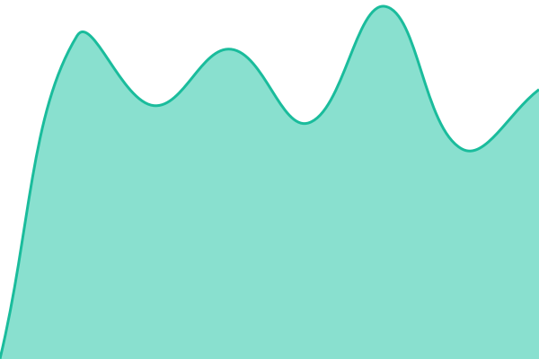
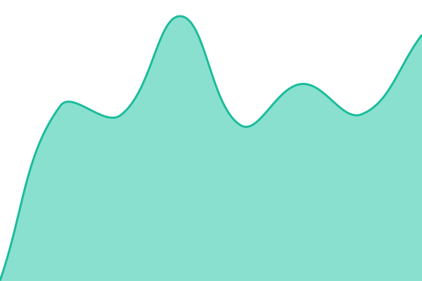
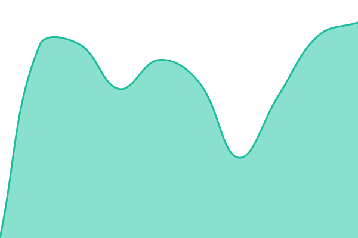
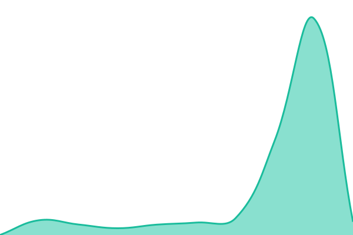
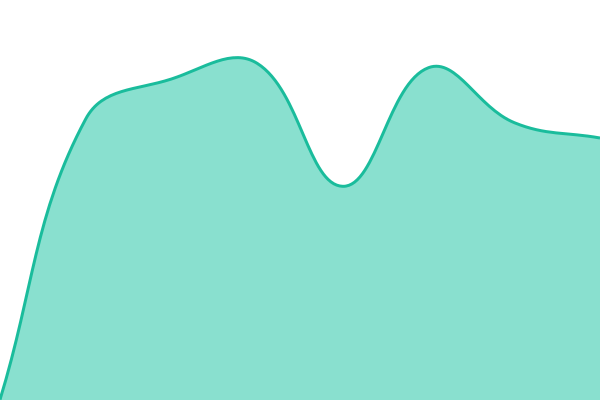
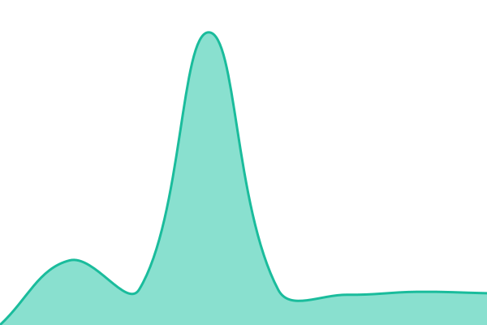
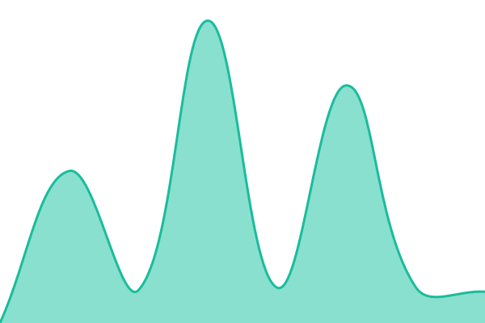

# [📈 Live Status](https://demo.upptime.js.org): <!--live status--> **🟧 Partial outage**

This repository contains the open-source uptime monitor and status page for [edgardoramosroque](https://demo.upptime.js.org), powered by [Upptime](https://github.com/upptime/upptime).

With [Upptime](https://upptime.js.org), you can get your own unlimited and free uptime monitor and status page, powered entirely by a GitHub repository. We use [Issues](https://github.com/edgardoramosroque/status/issues) as incident reports, [Actions](https://github.com/edgardoramosroque/status/actions) as uptime monitors, and [Pages](https://demo.upptime.js.org) for the status page.

<!--start: status pages-->
<!-- This summary is generated by Upptime (https://github.com/upptime/upptime) -->
<!-- Do not edit this manually, your changes will be overwritten -->
<!-- prettier-ignore -->
| URL | Status | History | Response Time | Uptime |
| --- | ------ | ------- | ------------- | ------ |
|  [Portal UNA](https://www.una.ac.cr/) | 🟩 Up | [portal-una.yml](https://github.com/EdgardoRamosRoque/status/commits/HEAD/history/portal-una.yml) | 

 1372ms
     
 | 

<a href="https://status.una.ac.cr/history/portal-una">100.00%</a>
    

|  [Carreras UNA](https://www.carreras.una.ac.cr/) | 🟩 Up | [carreras-una.yml](https://github.com/EdgardoRamosRoque/status/commits/HEAD/history/carreras-una.yml) | 

 1163ms
     
 | 

<a href="https://status.una.ac.cr/history/carreras-una">98.12%</a>
    

|  [Calendario Universitario](https://calendario.una.ac.cr/) | 🟩 Up | [calendario-universitario.yml](https://github.com/EdgardoRamosRoque/status/commits/HEAD/history/calendario-universitario.yml) | 

 586ms
     
 | 

<a href="https://status.una.ac.cr/history/calendario-universitario">96.55%</a>
    

|  [Portal Directorio](https://www.directorio.una.ac.cr/) | 🟩 Up | [portal-directorio.yml](https://github.com/EdgardoRamosRoque/status/commits/HEAD/history/portal-directorio.yml) | 

 1088ms
     
 | 

<a href="https://status.una.ac.cr/history/portal-directorio">100.00%</a>
    

|  [Portal UNACOMUNICA](https://www.unacomunica.una.ac.cr/) | 🟩 Up | [portal-unacomunica.yml](https://github.com/EdgardoRamosRoque/status/commits/HEAD/history/portal-unacomunica.yml) | 

 1350ms
     
 | 

<a href="https://status.una.ac.cr/history/portal-unacomunica">98.13%</a>
    

|  [Portal Transparencia](https://www.transparencia.una.ac.cr/) | 🟩 Up | [portal-transparencia.yml](https://github.com/EdgardoRamosRoque/status/commits/HEAD/history/portal-transparencia.yml) | 

 807ms
     
 | 

<a href="https://status.una.ac.cr/history/portal-transparencia">100.00%</a>
    

|  [Portal Preguntas Frecuentes](https://www.preguntasfrecuentes.una.ac.cr/) | 🟩 Up | [portal-preguntas-frecuentes.yml](https://github.com/EdgardoRamosRoque/status/commits/HEAD/history/portal-preguntas-frecuentes.yml) | 

 1124ms
     
 | 

<a href="https://status.una.ac.cr/history/portal-preguntas-frecuentes">98.13%</a>
    

|  [Portal Documentos](https://www.documentos.una.ac.cr/) | 🟩 Up | [portal-documentos.yml](https://github.com/EdgardoRamosRoque/status/commits/HEAD/history/portal-documentos.yml) | 

 509ms
     
 | 

<a href="https://status.una.ac.cr/history/portal-documentos">100.00%</a>
    

|  [Portal Repositorio](https://www.repositorio.una.ac.cr/) | 🟩 Up | [portal-repositorio.yml](https://github.com/EdgardoRamosRoque/status/commits/HEAD/history/portal-repositorio.yml) | 

 505ms
     
 | 

<a href="https://status.una.ac.cr/history/portal-repositorio">100.00%</a>
    

|  [Portal Revistas Universitarias](https://www.revistas.una.ac.cr/) | 🟩 Up | [portal-revistas-universitarias.yml](https://github.com/EdgardoRamosRoque/status/commits/HEAD/history/portal-revistas-universitarias.yml) | 

 661ms
     
 | 

<a href="https://status.una.ac.cr/history/portal-revistas-universitarias">100.00%</a>
    

|  [Portal RedAcademica](https://redacademica.una.ac.cr/) | 🟩 Up | [portal-red-academica.yml](https://github.com/EdgardoRamosRoque/status/commits/HEAD/history/portal-red-academica.yml) | 

 655ms
     
 | 

<a href="https://status.una.ac.cr/history/portal-red-academica">98.13%</a>
    

|  [Portal Rectoria](https://www.rectoria.una.ac.cr/) | 🟩 Up | [portal-rectoria.yml](https://github.com/EdgardoRamosRoque/status/commits/HEAD/history/portal-rectoria.yml) | 

 904ms
     
 | 

<a href="https://status.una.ac.cr/history/portal-rectoria">98.13%</a>
    

|  [Portal Registro](https://www.registro.una.ac.cr/) | 🟩 Up | [portal-registro.yml](https://github.com/EdgardoRamosRoque/status/commits/HEAD/history/portal-registro.yml) | 

 908ms
     
 | 

<a href="https://status.una.ac.cr/history/portal-registro">100.00%</a>
    

|  [Aula Virtual - Institucional](https://www.aulavirtual.una.ac.cr/) | 🟥 Down | [aula-virtual-institucional.yml](https://github.com/EdgardoRamosRoque/status/commits/HEAD/history/aula-virtual-institucional.yml) | 

 0ms
     
 | 

<a href="https://status.una.ac.cr/history/aula-virtual-institucional">0.00%</a>
    

|  [Portal Bibliotecas](https://www.siduna.una.ac.cr/) | 🟩 Up | [portal-bibliotecas.yml](https://github.com/EdgardoRamosRoque/status/commits/HEAD/history/portal-bibliotecas.yml) | 

 984ms
     
 | 

<a href="https://status.una.ac.cr/history/portal-bibliotecas">98.14%</a>
    

|  [Portal Vicerrectoria Vida Estudiantil](https://www.vidaestudiantil.una.ac.cr/) | 🟩 Up | [portal-vicerrectoria-vida-estudiantil.yml](https://github.com/EdgardoRamosRoque/status/commits/HEAD/history/portal-vicerrectoria-vida-estudiantil.yml) | 

 676ms
     
 | 

<a href="https://status.una.ac.cr/history/portal-vicerrectoria-vida-estudiantil">98.15%</a>
    

|  [Portal Vicerrectoria Administracion](https://www.vadm.una.ac.cr/) | 🟩 Up | [portal-vicerrectoria-administracion.yml](https://github.com/EdgardoRamosRoque/status/commits/HEAD/history/portal-vicerrectoria-administracion.yml) | 

 806ms
     
 | 

<a href="https://status.una.ac.cr/history/portal-vicerrectoria-administracion">100.00%</a>
    

|  [Portal Vicerrectoria Extension](https://www.extension.una.ac.cr/) | 🟩 Up | [portal-vicerrectoria-extension.yml](https://github.com/EdgardoRamosRoque/status/commits/HEAD/history/portal-vicerrectoria-extension.yml) | 

 791ms
     
 | 

<a href="https://status.una.ac.cr/history/portal-vicerrectoria-extension">98.15%</a>
    

|  [Portal Vicerrectoria Docencia](https://www.docencia.una.ac.cr/) | 🟩 Up | [portal-vicerrectoria-docencia.yml](https://github.com/EdgardoRamosRoque/status/commits/HEAD/history/portal-vicerrectoria-docencia.yml) | 

 774ms
     
 | 

<a href="https://status.una.ac.cr/history/portal-vicerrectoria-docencia">98.15%</a>
    

|  [Portal Proveeduria](https://www.proveeduria.una.ac.cr/) | 🟩 Up | [portal-proveeduria.yml](https://github.com/EdgardoRamosRoque/status/commits/HEAD/history/portal-proveeduria.yml) | 

 1460ms
     
 | 

<a href="https://status.una.ac.cr/history/portal-proveeduria">98.15%</a>
    

|  [Portal Facultad Filosofia](https://www.facultadfilosofia.una.ac.cr/) | 🟩 Up | [portal-facultad-filosofia.yml](https://github.com/EdgardoRamosRoque/status/commits/HEAD/history/portal-facultad-filosofia.yml) | 

 852ms
     
 | 

<a href="https://status.una.ac.cr/history/portal-facultad-filosofia">98.16%</a>
    

|  [Portal Facultad de Tierra y Mar](http://www.tierraymar.una.ac.cr/) | 🟩 Up | [portal-facultad-de-tierra-y-mar.yml](https://github.com/EdgardoRamosRoque/status/commits/HEAD/history/portal-facultad-de-tierra-y-mar.yml) | 

 770ms
     
 | 

<a href="https://status.una.ac.cr/history/portal-facultad-de-tierra-y-mar">100.00%</a>
    

|  [Portal Facultad de Ciencias Social](https://www.cienciassociales.una.ac.cr/) | 🟩 Up | [portal-facultad-de-ciencias-social.yml](https://github.com/EdgardoRamosRoque/status/commits/HEAD/history/portal-facultad-de-ciencias-social.yml) | 

 1661ms
     
 | 

<a href="https://status.una.ac.cr/history/portal-facultad-de-ciencias-social">100.00%</a>
    

|  [Portal Facultad de Ciencias Exactas y Naturales](https://www.exactasynaturales.una.ac.cr/) | 🟩 Up | [portal-facultad-de-ciencias-exactas-y-naturales.yml](https://github.com/EdgardoRamosRoque/status/commits/HEAD/history/portal-facultad-de-ciencias-exactas-y-naturales.yml) | 

 882ms
     
 | 

<a href="https://status.una.ac.cr/history/portal-facultad-de-ciencias-exactas-y-naturales">98.16%</a>
    

|  [Portal Estudios Generales](https://www.ceg.una.ac.cr/) | 🟩 Up | [portal-estudios-generales.yml](https://github.com/EdgardoRamosRoque/status/commits/HEAD/history/portal-estudios-generales.yml) | 

 832ms
     
 | 

<a href="https://status.una.ac.cr/history/portal-estudios-generales">98.16%</a>
    

|  [Portal CIDE](https://www.cide.una.ac.cr/) | 🟩 Up | [portal-cide.yml](https://github.com/EdgardoRamosRoque/status/commits/HEAD/history/portal-cide.yml) | 

 766ms
     
 | 

<a href="https://status.una.ac.cr/history/portal-cide">100.00%</a>
    

|  [Portal CIDEA](http://www.cidea.una.ac.cr/) | 🟩 Up | [portal-cidea.yml](https://github.com/EdgardoRamosRoque/status/commits/HEAD/history/portal-cidea.yml) | 

 698ms
     
 | 

<a href="https://status.una.ac.cr/history/portal-cidea">98.16%</a>
    

<!--end: status pages-->

[**Visit our status website →**](https://demo.upptime.js.org)

## 📄 License

- Powered by: [Upptime](https://github.com/upptime/upptime)
- Code: [MIT](./LICENSE) © [edgardoramosroque](https://demo.upptime.js.org)
- Data in the `./history` directory: [Open Database License](https://opendatacommons.org/licenses/odbl/1-0/)
